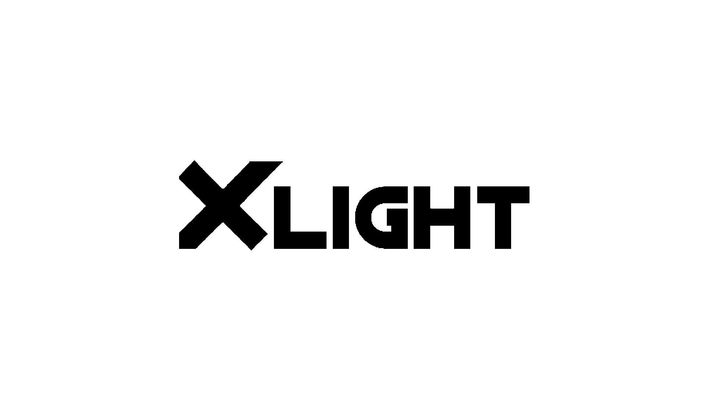
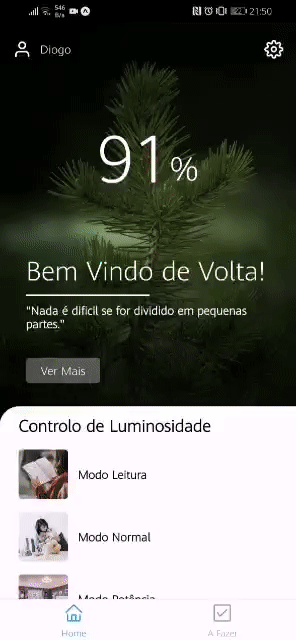

<h1 align="center">
    
</h1>

<h1 align="center">
    
</h1>

<h3 align="center">
    <a href="https://exp-shell-app-assets.s3.us-west-1.amazonaws.com/android/%40diogo14m/XLight-d3191baf1f98404d8d69de79d0fe9f10-signed.apk">Acessar a demonstração</a>
    <br>
    Pre-Alpha!
<h3 >

# Indice

- [Sobre](#-sobre)
- [Tecnologias Utilizadas](#-tecnologias-utilizadas)
- [Como baixar o projeto](#-como-baixar-o-projeto)

## 🔖&nbsp; Sobre

O projeto **XLight** foi criado no intuito de cumprir um estágio remoto. Toda a aplicação tem como objetivo, controlar uma luz, e definir diferentes regulações de luminosidade. É possivel também encontrar um área de lista de A Fazeres. Tem-se como intensão desenvolver todo o aplicativo ao longo do tempo, e desta forma, aproveitar toda a sua escabilidade.

---

## 🚀 Tecnologias utilizadas

O projeto foi desenvolvido utilizando as seguintes tecnologias

- [React Native](https://reactnative.dev/)
- [JavaScript](https://developer.mozilla.org/pt-PT/docs/Web/JavaScript)
- [Expo](https://https://expo.io/)

---

## 🗂 Como baixar o projeto

```bash

    # Clonar o repositório
    $ git clone https://github.com/Xavi002/XLight

    # Entrar no diretório
    $ cd XLight

    # Instalar as dependências
    $ yarn install

    # Iniciar o projeto
    $ yarn start
```

---

Desenvolvido por Diogo Martins